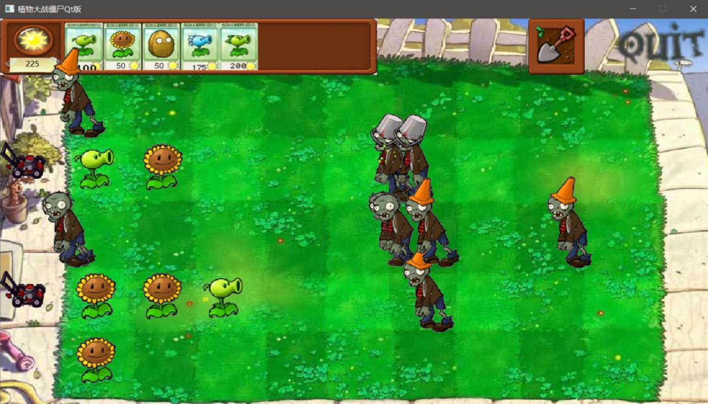

# Plant VS Zombie Qt Version

Course Project of C++ Programming Practice at PKU 2022 Spring.

Author: Tuanyu Jia, Wenhan Ma

Develop Environment: `Windows 10` `Qt 6.7.2` `MinGW 11.2.0 x64` `Qt creator 13.0.2` `VSCode`

Last Modified: 2024.7

